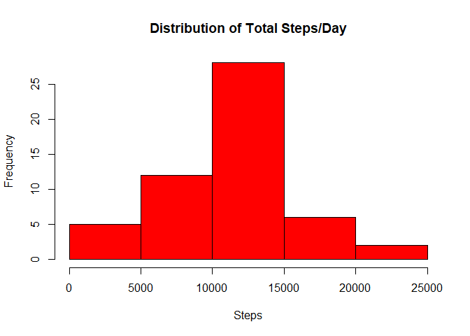
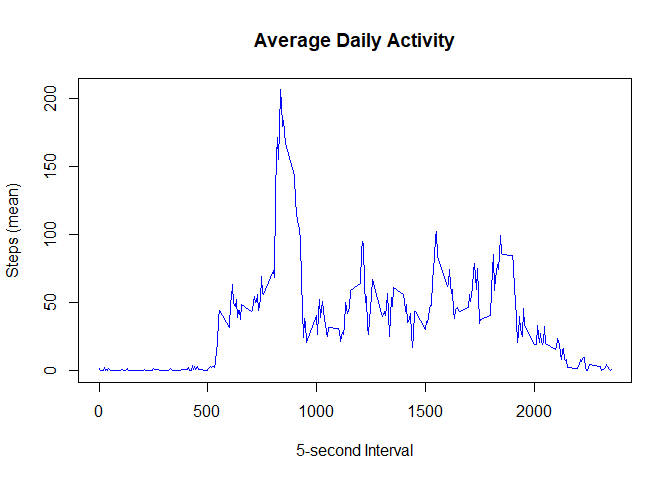
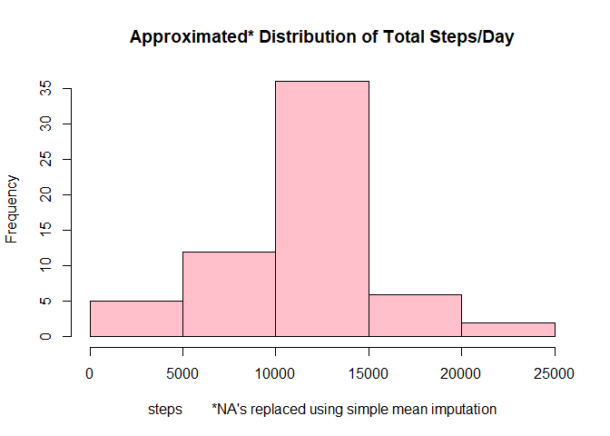
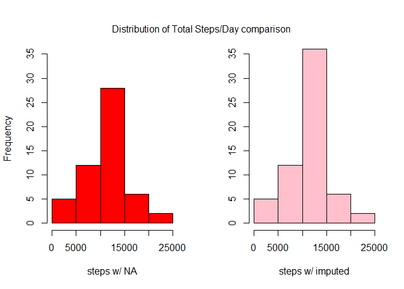
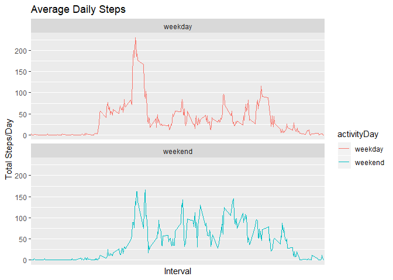

## Loading and preprocessing the data

1. I loaded the data. The data for this assignment can be downloaded from the 
course web site. The dataset is stored in a comma-separated-value (CSV) file and 
there are a total of 17,568 observations in this dataset.


```r
#Code for reading in the dataset and/or processing the data
url <- "https://d396qusza40orc.cloudfront.net/repdata%2Fdata%2Factivity.zip"
if(!file.exists("repdata_data_activity.zip")) {
        download.file(url, "repdata_data_activity.zip", method = "curl")
  }
if(!file.exists("activity.csv")){
        unzip("repdata_data_activity.zip")
  }
activity <- read.csv("activity.csv")
```

2. I transformed the data into a format suitable for my analysis.


```r
#change date class to POSIXct
activity$date <- as.POSIXct(activity$date, format = "%Y-%m-%d")
print(str(activity))
```

```
## 'data.frame':	17568 obs. of  3 variables:
##  $ steps   : int  NA NA NA NA NA NA NA NA NA NA ...
##  $ date    : POSIXct, format: "2012-10-01" "2012-10-01" ...
##  $ interval: int  0 5 10 15 20 25 30 35 40 45 ...
## NULL
```

Note: that there are a number of days/intervals where there are missing values 
(coded as \color{red}{\verb|NA|}NA). The presence of missing days may introduce 
bias into some calculations or summaries of the data.


## What is mean total number of steps taken per day?

For this part of the assignment, you can ignore the missing values in the 
dataset.

3. I calculated the total number of steps taken per day.


```r
#calculate total steps
stepSums <- aggregate(activity$steps ~ activity$date, FUN = sum)
names(stepSums) <- c("date", "steps")
print(head(stepSums))
```

```
##         date steps
## 1 2012-10-02   126
## 2 2012-10-03 11352
## 3 2012-10-04 12116
## 4 2012-10-05 13294
## 5 2012-10-06 15420
## 6 2012-10-07 11015
```

4. I made a histogram of the total number of steps taken each day.


```r
#Histogram of the total number of steps taken each day
hist(stepSums$steps, main = "Distribution of Total Steps/Day", xlab = "Steps",
     col = "red")
```

<!-- -->

5. I calculated the mean and median of the total number of steps taken per day.


```r
#calculate measures of center
options(scipen=999) # make knitr print large numbers expanded form
meanSteps <- mean(stepSums$steps, na.rm=TRUE)
medianSteps <- median(stepSums$steps, na.rm=TRUE)
```

The mean is about 10766 steps and the median is
10765 steps.


## What is the average daily activity pattern?

6. I made a time series plot (i.e. \color{red}{\verb|type = "l"|}type="l") of
The 5-minute interval (x-axis) and the average number of steps taken, averaged
across all days (y-axis).


```r
#Time series plot of the average number of steps taken
stepsByInterval <- aggregate(steps~interval, activity, mean)
stepsByInterval$timeSeriesSteps <- ts(stepsByInterval$steps)
plot.ts(x = stepsByInterval$interval, y = stepsByInterval$steps, type = "l",
        main = 'Average Daily Activity',  xlab = '5-second Interval', 
        ylab = "Steps (mean)", col = "blue")
```

<!-- -->

7. Which 5-minute interval, on average across all the days in the dataset,
contains the maximum number of steps?


```r
#The 5-minute interval that, on average, contains the maximum number of steps
maxSteps <- max(stepsByInterval$steps)
maxInterval<-stepsByInterval[maxSteps==stepsByInterval$steps,]$interval
```

On average across all days, the max number of 206 steps is taken at the
835^th^ five-second interval.


## Imputing missing values
Note that there are a number of days/intervals where there are missing values 
(coded as \color{red}{\verb|NA|}NA). The presence of missing days may introduce 
bias into some calculations or summaries of the data.

8. I calculated the total number of missing values in the dataset (i.e. the
total number of rows with \color{red}{\verb|NA|}NAs)

```r
#number of steps with NA
stepsNA <- sum(is.na(activity$steps)) 
```
There are 2304 missing values in the dataset.

9. I filled in all of the missing values in the dataset.

To impute the missing values:

* First, I found the **mean** for each **5-minute interval**.
* Next, I joined the means from the previous step with the original data set. 
The interal number was used a common identifier.
* Finally, I used an ifelse function to replace NA's with their corresponding 
interval mean.

10. I created a new dataset that is equal to the original dataset but with the 
missing data filled in.


```r
#Impute missing data
suppressMessages(require(dplyr))
## find mean of 5-second intervals
intervalMean <- aggregate(steps ~ interval, activity, mean)
## join intervalMean and original activity dataset
stepsJoin <- inner_join(x = activity, y = intervalMean, by = "interval",
                        suffix = c(".x", ".mean"))
## replace NA's using the ifelse() function.
activityImputed <- transform(stepsJoin, steps.x = ifelse(is.na(steps.x), 
                                                         round(steps.mean, 0), 
                                                         steps.x))
## tidy the data - remove interval means and rename imputed column
activityImputed <- activityImputed[,-4]
colnames(activityImputed)[1] <- "steps"
```

11. I made a histogram of the total number of steps taken each day then 
calculated and report the mean and median total number of steps taken per day.


```r
#Histogram of the total number of steps taken each day after missing values are imputed
imputedStepSums <- aggregate(activityImputed$steps ~ activityImputed$date, 
                             FUN = sum)
names(imputedStepSums) <- c("date", "steps")
hist(imputedStepSums$steps, col = "pink",
     main = "Approximated* Distribution of Total Steps/Day",
     xlab = "steps        *NA's replaced using simple mean imputation")
```

<!-- -->

```r
imputedMeanSteps <- mean(imputedStepSums$steps, na.rm=TRUE)
imputedMedianSteps <- median(imputedStepSums$steps, na.rm=TRUE)
```

These measures of center differ negligibly from the estimates in the first
part of the assignment. When rounded, the mean 10766 did not 
change ; the median increased from 10765 to 10762, a 
difference of 3 steps.


```r
# Two histograms arranged in 1 row and 2 columns
par(mfrow=c(1,2))
hist(stepSums$steps, main = NULL, xlab = "steps w/ NA", ylim = c(0,35), 
     col = "red")
hist(imputedStepSums$steps, col = "pink", ylim = c(0,35), ylab = NULL,
     main = NULL, xlab = "steps w/ imputed")
mtext("Distribution of Total Steps/Day comparison", side = 3, outer = TRUE,
      line = -3)
```

<!-- -->

However, the imputed data impacted the distribution of the data when calculating
the total daily sum. As you can see above, the magnitude of each bar increases,
especially toward the center of the data.


## Are there differences in activity patterns between weekdays and weekends?

12. I created a new factor variable in the dataset with two levels – “weekday”
and “weekend” indicating whether a given date is a weekday or weekend day.


```r
#convert weekday/weekend to factor variable
require(timeDate)
```

```
## Loading required package: timeDate
```

```r
activityDay <- isWeekday(activityImputed$date, wday=1:5)
activity2 <- cbind(activityImputed, activityDay)
activity2[,4] <- factor(activity2[,4],
                                levels = c("TRUE","FALSE"), 
                                labels = c("weekday", "weekend"))
print(str(activity2))
```

```
## 'data.frame':	17568 obs. of  4 variables:
##  $ steps      : num  2 0 0 0 0 2 1 1 0 1 ...
##  $ date       : POSIXct, format: "2012-10-01" "2012-10-01" ...
##  $ interval   : int  0 5 10 15 20 25 30 35 40 45 ...
##  $ activityDay: Factor w/ 2 levels "weekday","weekend": 1 1 1 1 1 1 1 1 1 1 ...
## NULL
```

13. I made a panel plot containing a time series plot 
(i.e. \color{red}{\verb|type = "l"|}type="l") of the 5-minute interval (x-axis) 
and the average number of steps taken, averaged across all weekday days or 
weekend days (y-axis). See the README file in the GitHub repository to see an 
example of what this plot should look like using simulated data.


```r
#Panel plot comparing the average number of steps taken per 5-minute interval 
#across weekdays and weekends
stepsByInterval2 <- aggregate(steps~interval + activityDay, activity2, mean)

require(ggplot2)
```

```
## Loading required package: ggplot2
```

```r
ggplot(stepsByInterval2 , aes(interval , steps, color = activityDay, group = 1)) +
        geom_line() + facet_wrap(~activityDay , ncol = 1, nrow = 2) +
        labs(title = "Average Daily Steps", x = "Interval", y = "Total Steps/Day") +
        scale_x_discrete(breaks = seq(0,2355,500))
```

<!-- -->
